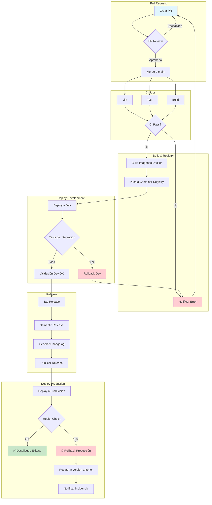

# CI/CD Pipeline Flow

Este documento describe el flujo completo del pipeline CI/CD desde la creación de un Pull Request hasta el despliegue en producción.

## Diagrama del Pipeline

## Descripción de las Etapas

### 1. Pull Request
- El desarrollador crea un Pull Request con los cambios propuestos
- El código pasa por revisión de pares
- Una vez aprobado, se hace merge a la rama principal (`main`)

### 2. CI Jobs (Continuous Integration)
- **Lint**: Verifica el estilo y calidad del código
- **Test**: Ejecuta pruebas unitarias y de integración
- **Build**: Compila el proyecto para verificar que no hay errores

### 3. Build & Registry
- Se construyen las imágenes Docker para cada servicio
- Las imágenes se suben al Container Registry (Docker Hub, GHCR, etc.)

### 4. Deploy Development
- Se despliega automáticamente en el entorno de desarrollo
- Se ejecutan tests de integración en el entorno desplegado
- Si fallan los tests, se realiza rollback automático

### 5. Release
- Se crea un tag con la versión usando semantic versioning
- Semantic Release analiza los commits y determina la versión
- Se genera el changelog automáticamente
- Se publica el release en GitHub

### 6. Deploy Production
- Se despliega a producción la nueva versión
- Se realizan health checks para verificar el estado
- Si el despliegue falla, se ejecuta rollback automático

## Rollback

El pipeline incluye mecanismos de rollback en dos puntos críticos:

1. **Rollback en Development**: Si los tests de integración fallan después del despliegue en dev
2. **Rollback en Production**: Si el health check falla después del despliegue en producción

El rollback restaura automáticamente la versión anterior estable y notifica al equipo de la incidencia.
